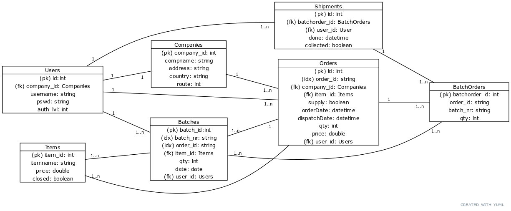

# Tietokanta

Tietokanta koostuu 7 eri taulukosta.



### Schema

```
CREATE TABLE companies(
	company_id SERIAL PRIMARY KEY,
	compname TEXT NOT NULL,
	address TEXT NOT NULL,
	email TEXT NOT NULL,
	country TEXT,
	route SMALLINT);

CREATE TABLE items(
	item_id SERIAL PRIMARY KEY,
	itemname TEXT NOT NULL,
	price NUMERIC NOT NULL,
	closed BOOLEAN DEFAULT FALSE);

CREATE TABLE users(
	user_id SERIAL PRIMARY KEY,
	company_id INT,
	username TEXT NOT NULL,
	pswd TEXT NOT NULL,
	auth_lvl SMALLINT NOT NULL,
	CONSTRAINT fk_company_id
		FOREIGN KEY(company_id)
			REFERENCES companies(company_id));

CREATE TABLE orders(
	id SERIAL PRIMARY KEY,
	order_id TEXT NOT NULL,
	company_id INT NOT NULL,
	item_id INT NOT NULL,
	supply BOOLEAN,
	orderDate TIMESTAMP  NOT NULL,
	dispatchDate TIMESTAMP,
	qty INT NOT NULL,
	price NUMERIC NOT NULL,
	user_id INT NOT NULL,
	CONSTRAINT fk_company_id
		FOREIGN KEY(company_id)
			REFERENCES companies(company_id),
	CONSTRAINT fk_user_id
		FOREIGN KEY(user_id)
			REFERENCES users(user_id),
	CONSTRAINT fk_item_id
		FOREIGN KEY(item_id)
			REFERENCES items(item_id));

CREATE INDEX order_id_idx ON orders (order_id);

CREATE TABLE batches(
	batch_id SERIAL PRIMARY KEY,
	batch_nr TEXT NOT NULL,
	company_id INT NOT NULL,
	item_id INT NOT NULL,
	qty INT,
	date TIMESTAMP,
	user_id INT NOT NULL,
	CONSTRAINT fk_company_id
		FOREIGN KEY(company_id)
			REFERENCES companies(company_id),
	CONSTRAINT fk_user_id
		FOREIGN KEY(user_id)
			REFERENCES users(user_id));

CREATE INDEX batch_nr_idx ON batches (batch_nr);

CREATE TABLE batchorders(
	batchorder_id SERIAL PRIMARY KEY,
	order_id TEXT NOT NULL,
	batch_nr TEXT NOT NULL,
	item_id INT NOT NULL,
	qty INT NOT NULL,
	CONSTRAINT fk_order_id
		FOREIGN KEY(order_id)
			REFERENCES orders(order_id),
	CONSTRAINT fk_item_id
		FOREIGN KEY(item_id)
			REFERENCES items(item_id));

CREATE TABLE shipments(
	shipment_id SERIAL PRIMARY KEY,
	order_id TEXT NOT NULL,
	batchorder_id INT NOT NULL,
	user_id INT NOT NULL,
	done TIMESTAMP NOT NULL,
	collected BOOLEAN,
	CONSTRAINT fk_batchorder_id
		FOREIGN KEY(batchorder_id)
			REFERENCES batchorders(batchorder_id),
	CONSTRAINT fk_user_id
		FOREIGN KEY(user_id)
			REFERENCES users(user_id));
```
